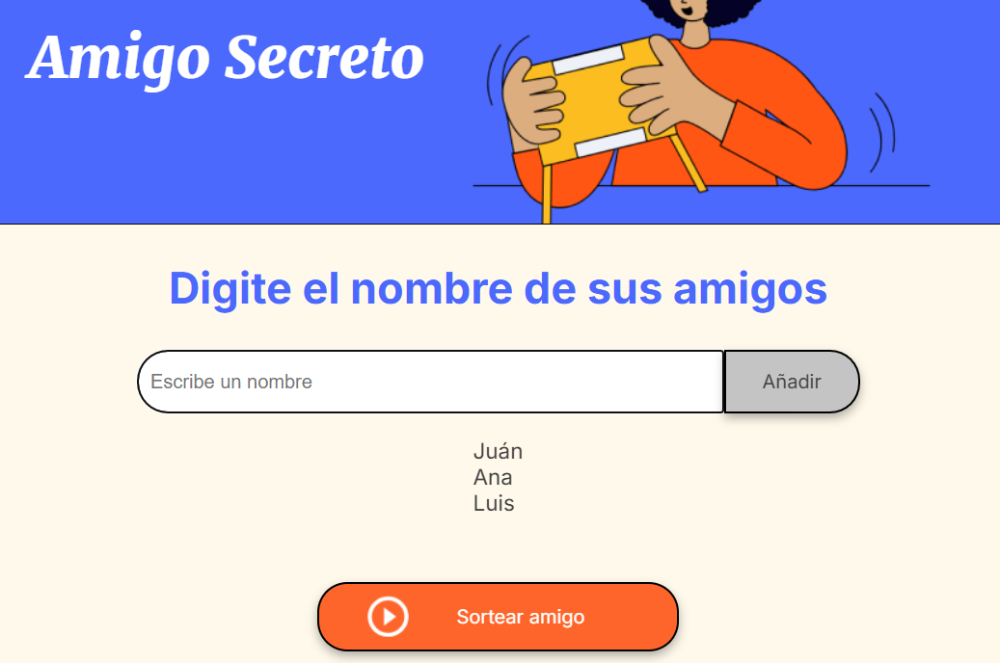
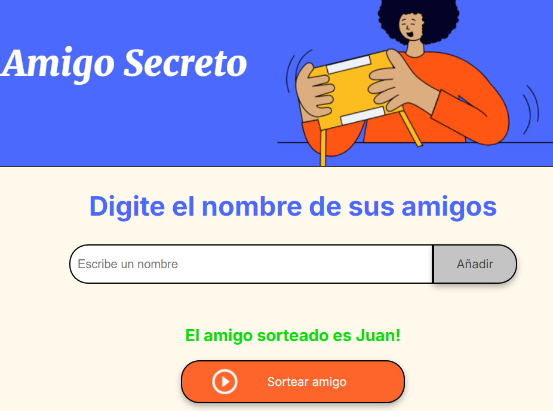

# Amigo secreto

Aplicación web simple para organizar un juego de amigo secreto. El usuario ingresa nombres de participantes, para luegar realizar un sorteo aleatorio eligiendo un amigo.

.

## Funcionalidad
1. Se ingresan los nombres al cuadro de texto. Se pueden ingresar ya sea presionando el botón añadir o presionando la tecla Enter.
2. Los nombres agregados se iran viendo en la lista.
3. Una vez se finaliza agregar nombres, se procede a presionar el botón "Sortear amigo".
4. Finalmente se muestra el resultado.

